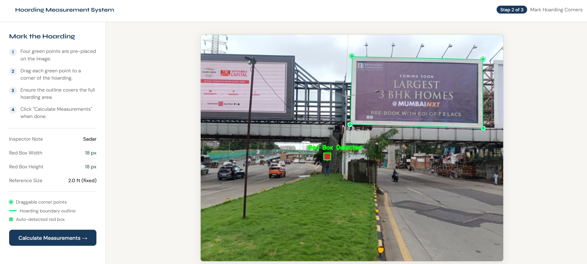
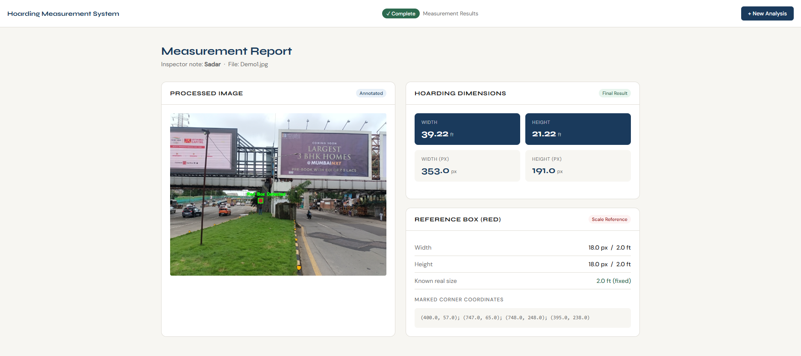

# Hoarding Dimension Calculator

A computer vision-based web application that estimates real-world dimensions of outdoor hoardings using image processing and a reference object.

## 🚀 Features
- Upload hoarding images
- Automatic detection of reference object (red box)
- Interactive corner marking for precise measurement
- Converts pixel values into real-world dimensions (feet)

## 🛠 Tech Stack
- Python (Flask)
- OpenCV
- HTML, CSS, JavaScript

## ⚙️ How It Works
1. User uploads an image containing a red reference box
2. System detects the reference box using image processing
3. User marks the hoarding boundaries
4. Dimensions are calculated based on pixel-to-real-world conversion

## 📸 Demo

### Upload Interface

### Detection & Marking

### Final Measurement Output

## 📌 Use Case
This system can assist in automating measurement tasks in advertising, inspections, and site analysis where manual measurement is difficult.

